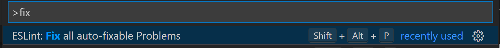

# Part 1 - Setting up VSCode for Developing JavaScript Web Resources using TypeScript

This is part of the course 'Scott's guide to building Power Apps JavaScript Web Resources using TypeScript'.

In this first part, we will cover setting up your VSCode environment to create TypeScript [Dataverse JavaScript Web resources.](https://docs.microsoft.com/en-us/powerapps/developer/model-driven-apps/web-resources)

## Pre-Requisites

Before you start, you will need to install the following:

-   **NodeJS** - <https://bit.ly/getnodejs>
-   **VSCode** - <https://bit.ly/downloadvscode>
-   **Visual Studio** - <https://visualstudio.microsoft.com/downloads/> (Community Edition is free!)

When installing Node, select the LTS version and accept the defaults.


To check you have Node installed correctly, at the command line type:

```shell
npm
```

You should see the npm command help information displayed.

To check you had VSCode installed correctly, at the command line type:

```shell
Code .
```

This should open VSCode at the folder location you are currently in.

## TypeScript VSCode Quick Start

### Project folder setup

VSCode TypeScript projects do not have a project file like C\# (`.csproj`) – so
you can simply create a new folder with the name of your project. I will use
`clientjs.`

At the command line, type:

```shell
mkdir clientjs
cd clientjs
```

### Npm setup

Npm is used to install required modules into a node_modules folder. To intialise
your project type:

```shell
npm init
```

Press Return on each prompt to accept the defaults.

### TypeScript setup

TypeScript is used to initialise the project folder with a `tsconfig.json` file.

At the command line, type:

```shell
npm install typescript --save-dev
npx tsc -init
Code .
```

You should see VSCode open with a project similar to:

****

Open the tsconfig.json file and make the following changes:

```json
"module": "es2015",
"lib": ["es2015","dom"],  
"rootDir": "src",
"moduleResolution": "node",
"sourceMap": true,  
```

-   **`module` -** This is important to set to es2015 so that webpack can
    ‘tree-shake’ and decide which modules it needs to output in the bundle.

-   **`lib`** tells typescript that we can use the ES2015 features (e.g. Promise)
    and HTML Dom libraries because they will be available at runtime.

-   **`rootDir`** – We are putting our TypeScript inside the src folder. This is a
    common convention and separates the TypeScript from other resources that we
    may have in our project.

-   **`moduleResolution` –** This tells TypeScript that we are writing our code in
    the same way that we would load modules when running inside a Node
    environment. This is because later, webpack will work out how to package the
    modules that we are using so that they will run inside the browser.

-   **`sourceMap` –** This tells TypeScript that we want to produce sourcemaps for
    our TypeScript code so that webpack can package them when creating
    development builds for debugging inside the browser.

>   **Important**: The node_modules contains the files that are downloaded by
>   npm. They are not necessary to be checked into source-code and can be
>   re-installed at anytime by deleting the node_modules folder and running the
>   command: `npm install`

### Install `ESLint` & `prettier`

You should always use a linter with your TypeScript projects to catch common
issues and promote best practices. ESLint is the most common linter used with
TypeScript today. prettier then ensures your code is always formatted
consistently so that you do not get noisy diffs when committing to source
control.

Grab the following files and copy them to your project folder:

-   [.eslintrc.json](https://raw.githubusercontent.com/scottdurow/dataverse-jswebresource-template/master/.eslintrc.json)

-   [.prettierrc.json](https://raw.githubusercontent.com/scottdurow/dataverse-jswebresource-template/master/.prettierrc.json)

>   **NOTE:** the leading full stop (.) on the filename is very important!

At the command line type:

```shell
npm install --save-dev eslint @typescript-eslint/eslint-plugin @typescript-eslint/parser eslint-plugin-react eslint-config-prettier eslint-plugin-prettier

npm install --save-dev --save-exact prettier
```

This will install the eslint and prettier node modules.

### Install the `ESLint` VSCode Extension

We will uses the ESLint VSCode extension. This will give you a code lens that
provides feedback of any linting/prettifier issues.

1. Install the ESLint Marketplace extension to VSCode. The ESLint extensions
   simply uses the ESLint configuration of your project.
   
2. Add a new file under a folder named `src`, named `index.ts` - this will mean that ESLint will start running on our project.
3. Close and Re-open VSCode ensure that ESLint is running. You should now see
   ESLint in the status bar of VSCode:  
     
   *Note: The ESLint extension will pick up the eslint configuration files you
   have – it will not run on projects that are not configured to work with
   eslint.*
4. Open Settings in VSCode, and type ‘code action on save’
5. Under the **Workspace Tab**, select **Edit in settings.json** under **Editor: Code Actions On Save’**
   
6. In the `settings.json`, ensure it is set to:

```json
{
    "editor.codeActionsOnSave": {
        "source.fixAll": true
    }
}
```

This will now ensure your code files are formatted consistently when saving.

>   **Note:** There is one downside with this setting in that it will often
>   result in longer save-times. You may prefer to use the command `ESLint: Fix
>   all auto fixable problems` instead. You can assign a keyboard short-cut to
>   this command – I use `Shift + Alt + P
>   `

### Install `@types/xrm`

The JavaScript we are going to write will use the Xrm Client Api. To enable
strong types in our code we install the `@types/xrm` node module.

1. At the command line, Type:

```shell
npm install --save-dev @types/xrm
```

2. Add a new folders and file `src/Forms/AccountForm.ts`

3. Add the following code:

```typescript
export class AccountForm {
  static async onload(context: Xrm.Events.EventContext): Promise<void> {
    context
      .getFormContext()
      .getAttribute("name")
      .addOnChange(() => {
        console.log("name onchange");
      });
  }
}
```

If you type this in manually, you will see the intellisense for the Xrm types
that is provided by the module `@types/xrm`. 


If you make any changes to this file you may start to see red underlined areas
that indicate ESLint formatting issues:


When you save, these should be auto-fixed if you have that setting turned on. If
not, use the VSCode command `ESLint: Fix all auto-fixable Problems`

You may also see yellow underlined areas where there are ESLint issues:


These cannot be auto-fixed, but you may ignore if needed by pressing `Ctrl + .`
or ‘Quick Fix..’ and then **Disable for this line** or **Disable for the entire
file**. This will add a comment into your code telling ESLint that you are ok to
ignore the issues.

## Up Next...

In the next part we will look at using `webpack` to bundle our transpiled JavaScript so that it can be run inside the browser.

