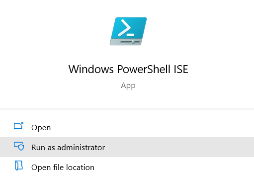

# Part 9 - Calling Custom APIs from TypeScript

This is part of the course 'Scott's guide to building Power Apps JavaScript Web Resources using TypeScript'.

In this ninth part we will cover how to call a custom API that is build using C# and deployed via a Plugin, using `dataverse-ify` with `dataverse-gen`. The advantage of using `datasverse-ify` is that it will generate types for you so that you can easily provide the correct data and then execute the request, then read the response in a similar way to the `IOrganizationService`.

`Dataverse-ify` is an open source library that aims to provide an interface to the Dataverse `WebApi` from TypeScript that works in a similar way to the C\# `IOrganisationService` so that you do not need to code around the complexities of the native `WebApi` syntax. See <https://github.com/scottdurow/dataverse-ify/wiki>

## Create the Custom API Definition

First we are going to implement a Custom API that does the same as the TypeScript called to close all open opportunities. Before we write the code, we will define the Input and Output parameters using the [Custom API Manager plugin for the XrmToolBox by David Rivard](https://github.com/drivardxrm/XTB.CustomApiManager). You can also add Custom APIs using the solution explorer. 

Firstly install the Plugin into the XrmToolBox and open a connection to your environment.

Create a new Custom API with the following parameters:


Now create the following **input** parameters:

**Unique Name:** `subject`

- Name: `CloseAllOpportunities-In-Subject`
- Display Name: `CloseAllOpportunities In Subject`
  **Note**: This name is shown in the maker portal so ensure it is fully descriptive to distinguish from other parameters.
- Description: The subject to add to the Close Opportunity Activity
- Type: `String`

**Unique Name:** `whatIf`

- Name: `CloseAllOpportunities-In-WhatIf`
- Display Name: `CloseAllOpportunities In WhatIf`
- Description: Set to true to just return the opportunities that will be closed
- Type: `Boolean`
- Is Optional : `True`


Also create the following output parameter:

**Unique Name:** `opportunityCount`

- Name: `CloseAllOpportunities-Out-OpportunityCount`
- Display Name: `CloseAllOpportunities Out OpportunityCount`
- Description: The number of opportunities closed (or that will be closed if the What If input parameter is true)
- Type: `Integer`

It should looks similar to:


**Note:** The unique name is the name that is exposed to our code. I have chosen to use `camelCase` since we will be calling via TypeScript - but equally `PascalCase` would be acceptable - especially if you are calling via another C# client.

## Add to the solution

Now you have added your Custom API Definition, you will need to open your solution in make.powerapps.com and add the Custom API:


## Create c# Plugin 

We can now add the implementation of our Custom API using a c# plugin.

1. Create a new Visual Studio Project in the same solution as the DataverseSolution project we created in Part 4.
2. Select 'Class Library (.Net Framework)'
3. Name the project DataversePlugins and ensure the .Net Framework version is 4.6.2
4. You should end up with a solution that looks like the following:
   
5. Right click on the project and select Manage NuGet Packages
6. Select the Browse tab and search for spkl as we did in Part 4. Install `spkl` to the Plugin Project
7. Also search for `Microsoft.CrmSdk.XrmTooling.CoreAssembly` and install the latest version into your Plugin Project
8. Rename `Class1.cs` to `CloseAllOpportunitiesPlugin.cs`
9. Update the code to the following:

```csharp
using Microsoft.Xrm.Sdk;
using System;

namespace DataversePlugins
{
    [CrmPluginRegistration("dev1_CloseAllOpportunities")]
    public class CloseAllOpportunitiesPlugin : IPlugin
    {
        public void Execute(IServiceProvider serviceProvider)
        {
            throw new NotImplementedException();
        }
    }
}
```


## Deploy Plugin

So that we can wire up our Custom API definition to the plugin, we must deploy our plugin. This can be done easily using spkl.

1. Open the Properties on your `DataversePlugins` project, and select the Signing Tab. 

3. Check Sign the Assembly and then **<New..>.** Provide a certificate name (e.g. Plugins) and uncheck **Protect my key file with a password**

4. Save the project `Ctrl + S`

5. Build you Plugin Project `Ctrl + Shift + B`

6. Add the command line with the current directory set to be the `DataversePlugins\spkl` folder, type:

   ```shell
   C:\jswebresources\DataversePlugins\spkl>deploy-plugins.bat
   ```


7. Login to your Dataverse Environment as we did in Part 4 - or select an existing connection to the target environment.
   

8. You should see a message that your plugin has been deployed and registered against your custom API.
   


Early Bound Types for your Custom API Plugin

1. Edit the `spkl.json` file so that the existing `earlyboundtypes` node has the following:

```json
"earlyboundtypes": [
        {
            "entities": "account,opportunity,opportunityclose",
            "actions": "",
            "generateOptionsetEnums": "true",
            "generateStateEnums": "true",
            "generateGlobalOptionsets": false,
            "filename": "EarlyBoundTypes.cs",
            "oneTypePerFile": false,
            "classNamespace": "DataversePlugins",
            "serviceContextName": "XrmSvc"
        }
    ]
```

**Note:** The key here is that we are adding the `account`, `opportunity`, & `opportunityclose` to be generated as early bound types. The `WinOpportunityRequest` is already available under the `Microsoft.Crm.Sdk.Messages` namespace

2. At the command line under the `DataversePlugins\spkl` folder, type:

   ```shell
   C:\jswebresources\DataversePlugins\spkl>earlybound.bat
   ```


3. You will now get a file generated in your project called `EarlyBoundTypes.cs` which you can add to your project by selecting **Show All Files** on the project context menu, and then **Include in Project** from the file context menu.

## Add Integration Test

We can test our plugin logically against Dataverse before we deploy and test so that we can step through our code that would normally be executing on the server.

First we need to create an application user to authenticate against Dataverse. If you don't want to perform integration tests inside Visual Studio, can skip this section.

Open PowerShell ISE as an Administrator




Create a using the instructions here  [Service Principle](https://docs.microsoft.com/en-us/power-platform/alm/devops-build-tools#create-service-principal-and-client-secret-using-powershell)

1. Download the script [New-CrmServicePrinciple.ps1](https://pabuildtools.blob.core.windows.net/spn-docs-4133a3fe/New-CrmServicePrincipal.ps1)
2. Open this in the PowerShell ISE Admin session and press the green **Run Script** or press `F9`
3. You will be asked to login twice - first login with a user that is an Azure AD Administrator and then login with a user that is a Power Platform Administrator - you can use the same account for both logins if you have one!
4. You will be given a set of values that you must make a note of since you will not be able to get them again:


5. Download the Script from 
6. Open the Script in your PowerShell ISE, and replace the `ApplicationId` with the value from step 4
   
7. Press the green **Run Script** or press `F9`
8. Accept the request to install the modules.
9. You should get a message that the Application User has been added.

Add a new project of type **Unit Test Project (.Net Framework)** called `DataversePlugins.IntegrationTest`


To your Test project add a new `app.config`


To the `app.config`, add the following:

```xml
<?xml version="1.0" encoding="utf-8" ?>
<configuration>
  <appSettings>
    <add key="IntegrationTestConnectionString" value="AuthType=ClientSecret;url=https://<YOUR_ORG>.<YOUR_REGION>.dynamics.com;ClientId=<APPLICATION_ID>;ClientSecret=<CLIENT_SECRET>" />
  </appSettings>
</configuration>
```

The `ClientId` is the `Application ID` from when you ran the first PowerShell script, as is the `Client Secret`.

Right click on the Test Project and **Manage NuGet Packages**

Install the following packages to the Test Project:

- `spkl.fakes` 
- `System.Configuration.ConfigurationManager` 
- `Microsoft.Xrm.Tooling.Connector`
- `Microsoft.Sdk.Crm.CoreAssembles`

Also, add a reference to your Plugin Project:


Add the following code to the test class:

```
using Microsoft.Crm.Sdk.Fakes;
using Microsoft.VisualStudio.TestTools.UnitTesting;
using Microsoft.Xrm.Sdk;
using Microsoft.Xrm.Tooling.Connector;
using System.Configuration;

namespace DataversePlugins.IntegrationTest
{
    [TestClass]
    public class CloseAllOpportunitiesTest : CloseAllOpportunitiesPlugin
    {
        [TestMethod]
        public void CloseAllOpportunities()
        {
            var connectionString = ConfigurationManager.AppSettings["IntegrationTestConnectionString"];
            var service = new CrmServiceClient(connectionString);

            // Arrange
            var account = new Account()
            {
                Name = "Integration Test",

            };
            account.Id = service.Create(account);
            var opportunity = new Opportunity()
            {
                Name = "Test"
            };
            opportunity.CustomerId = account.ToEntityReference();
            opportunity.Id = service.Create(opportunity);

            // Act
            try
            {
                using (var pipeline = new PluginPipeline("dev1_CloseAllOpportunities", FakeStages.PostOperation, account.ToEntity<Entity>(), service))
                {
                    pipeline.InputParameters["subject"] = "Test";
                    pipeline.Execute(this);
                }

                // Assert
                var closedOp = service.Retrieve(opportunity.LogicalName, opportunity.Id, new Microsoft.Xrm.Sdk.Query.ColumnSet(new[] { "statecode" })) as Opportunity;
                Assert.AreEqual(OpportunityState.Won, closedOp.StateCode);
            }
            finally
            {
                service.Delete(opportunity.LogicalName, opportunity.Id);
                service.Delete(account.LogicalName, account.Id);
            };
        }

        [TestMethod]
        public void CloseAllOpportunitiesWhatIf()
        {
            var connectionString = ConfigurationManager.AppSettings["IntegrationTestConnectionString"];
            var service = new CrmServiceClient(connectionString);

            // Arrange
            var account = new Account()
            {
                Name = "Integration Test",

            };
            account.Id = service.Create(account);
            var opportunity = new Opportunity()
            {
                Name = "Test"
            };
            opportunity.CustomerId = account.ToEntityReference();
            opportunity.Id = service.Create(opportunity);

            // Act
            try
            {
                using (var pipeline = new PluginPipeline("dev1_CloseAllOpportunities", FakeStages.PostOperation, account.ToEntity<Entity>(), service))
                {
                    pipeline.InputParameters["subject"] = "Test";
                    pipeline.InputParameters["whatIf"] = true;
                    pipeline.Execute(this);
                }

                // Assert
                var closedOp = service.Retrieve(opportunity.LogicalName, opportunity.Id, new Microsoft.Xrm.Sdk.Query.ColumnSet(new[] { "statecode" })) as Opportunity;
                Assert.AreEqual(OpportunityState.Open, closedOp.StateCode);
            }
            finally
            {
                service.Delete(opportunity.LogicalName, opportunity.Id);
                service.Delete(account.LogicalName, account.Id);
            };
        }
    }
}

```

These two tests do a very similar task to the integration tests that we build in Part 7. We test that the Custom API is working by arranging the records needed, calling the plugin, checking the actions have been carried out and then tidying up.

If you run the tests, they will fail since we have not implemented the logic yet!

## Implement the Custom API Logic

Inside the `DataversePlugins` project, add the following code to the Plugin we created above:

```
using Microsoft.Crm.Sdk.Messages;
using Microsoft.Xrm.Sdk;
using Microsoft.Xrm.Sdk.Query;
using System;

namespace DataversePlugins
{
    [CrmPluginRegistration("dev1_CloseAllOpportunities")]
    public class CloseAllOpportunitiesPlugin : IPlugin
    {
        public void Execute(IServiceProvider serviceProvider)
        {
            ITracingService tracingService =
            (ITracingService)serviceProvider.GetService(typeof(ITracingService));
            IPluginExecutionContext context = (IPluginExecutionContext)
                serviceProvider.GetService(typeof(IPluginExecutionContext));
            IOrganizationServiceFactory factory = (IOrganizationServiceFactory)serviceProvider.GetService(typeof(IOrganizationServiceFactory));
            var service = factory.CreateOrganizationService(context.UserId);
            try
            {
                var accountid = context.PrimaryEntityId;
                var subject = (string)context.InputParameters["subject"];
                var whatIf = context.InputParameters.ContainsKey("whatIf") ? (bool?)context.InputParameters["whatIf"] : null;

                var fetchQuery = string.Format(@"<fetch>
                                <entity name='opportunity' >
                                    <attribute name='opportunityid' />
                                    <attribute name='name' />
                                    <filter>
                                      <condition attribute='customerid' operator='eq' value='{0}' />
                                      <condition attribute='statecode' operator='eq' value='0' />
                                    </filter>
                                  </entity>
                                </fetch>", accountid);
                tracingService.Trace("Executing fetch query:{0}", fetchQuery);

                // Count Open Opportunites
                var openOpportunities = service.RetrieveMultiple(new FetchExpression(fetchQuery));
                var opportunityCount = openOpportunities.Entities.Count;

                context.OutputParameters["opportunityCount"] = opportunityCount;

                if (whatIf == true)
                    return;

                foreach (var opportunity in openOpportunities.Entities)
                {
                    var closeRequest = new WinOpportunityRequest
                    {
                        Status = new OptionSetValue((int)opportunity_statuscode.Won),
                        OpportunityClose = new OpportunityClose
                        {
                            Subject = subject,
                            OpportunityId = opportunity.ToEntityReference()
                        }
                    };
                    service.Execute(closeRequest);
                }
            }
            catch (Exception ex)
            {
                throw new InvalidPluginExecutionException("Cannot close Opportuntities:" + ex.ToString(), ex);
            }
        }
    }
}
```

If you now run the integration tests, they should show as passing if everything is configured correctly. You can step through the code to see it executing.

The last thing to do here is deploy your plugin at the command line under the `DataversePlugins\spkl` folder, using:

```shell
C:\jswebresources\DataversePlugins\spkl>deploy-plugins.bat
```

## Generate the TypeScript Custom API Types

Now we have our Custom API working, we need to generate the types to call it using dataverse-ify and then change the TypeScript code accordingly.

Open your TypeScript `clientjs` project and at the command prompt type:

```
npx dataverse-gen init
```

When you are prompted to select actions, you should now be able to select our custom API `dev1_CloseAllOpportunities`

This will generate a new set of types and metadata for the custom API. Update the TypeScript `AccountRibbon.closeOpportunitiesInternal` function with the following:

```
static async closeOpportunitiesInternal2(serviceClient: CdsServiceClient, accountid: string): Promise<void> {
  setMetadataCache(metadataCache);
  const closeOpportunityRequest = {
    logicalName: dev1_CloseAllOpportunitiesMetadata.operationName,
    entity: new EntityReference(accountMetadata.logicalName, accountid),
    subject: "Closed",
    whatIf: true,
  } as dev1_CloseAllOpportunitiesRequest;
  try {
    const closeResponseWhatIf = (await serviceClient.execute(
      closeOpportunityRequest,
    )) as dev1_CloseAllOpportunitiesResponse;

    const openOps = closeResponseWhatIf.opportunityCount;

    if (openOps == 0) {
      await Xrm.Navigation.openAlertDialog({ text: `There are no open opportunties!` });
      return;
    }

    const result = await Xrm.Navigation.openConfirmDialog({
      title: "Close All Open Opportunities?",
      text: `Are you sure you want to close the ${openOps} open opportunities?`,
    });
    if (!result.confirmed) return;
    closeOpportunityRequest.whatIf = false;
    Xrm.Utility.showProgressIndicator("Closing Opportunities, Please Wait...");

    const closeResponse = (await serviceClient.execute(
      closeOpportunityRequest,
      // eslint-disable-next-line camelcase
    )) as dev1_CloseAllOpportunitiesResponse;
    Xrm.Utility.closeProgressIndicator();
    await Xrm.Navigation.openAlertDialog({
      title: "Success",
      text: `${closeResponse.opportunityCount} Opportunities closed`,
    });
  } catch (ex) {
    Xrm.Utility.closeProgressIndicator();
    Xrm.Navigation.openErrorDialog({
      details: ex,
      message: `Could not close opportunites:\n${ex.message}\n`,
    });
  }
}
```

You'll see that we are now calling execute with `dev1_CloseAllOpportunitiesResponse` - first with `whatIf` set to `true`, and then with it set to false to actually close the opportunities.

`dataverse-ify` makes it really easy because you don't have to remember all the input and output parameters- they are all generated for you and strongly typed.

## This is the end of the first section!

In the next section we will look at managing the Application Lifecycle of our solution with automated builds and deployments of our TypeScript and C# code.

